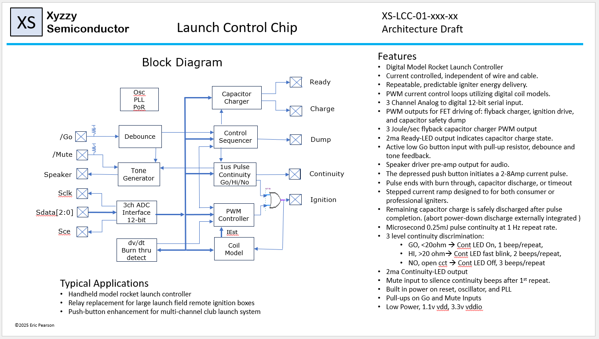
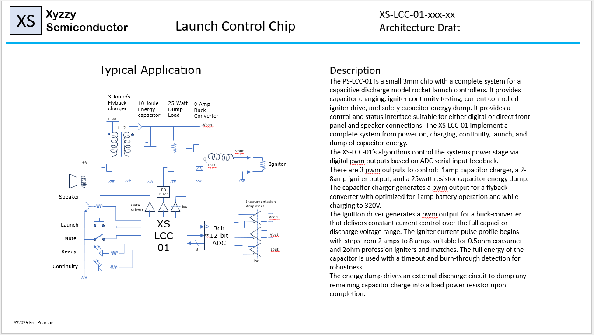
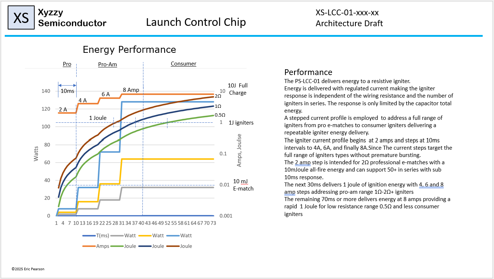
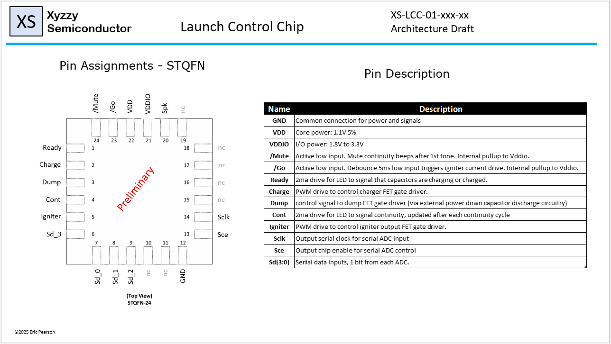
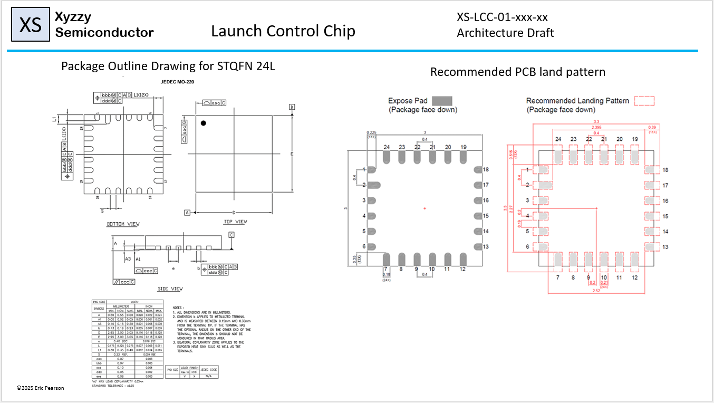
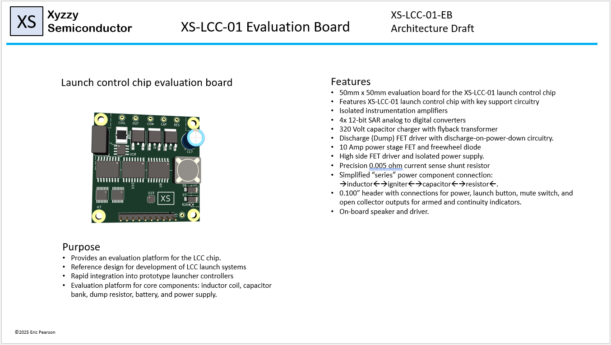
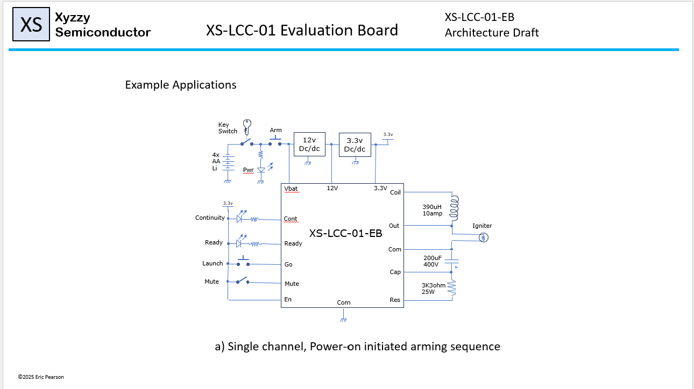
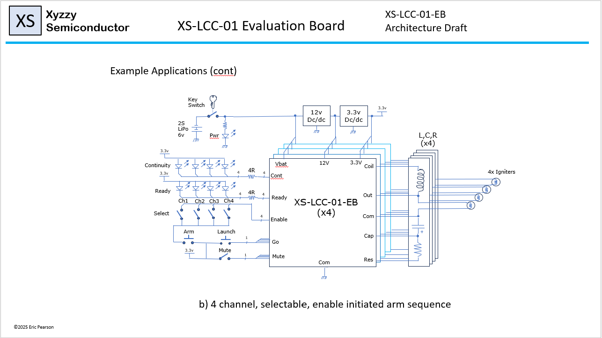

# launch_chip
A model rocket launch control chip. A better push button?

## Datasheet.
Semiconductors start out as an idea. Early datasheets allow exploration of the functionallity to meet the system need.
I've created a mock datasheet for a launch control chip, to both inspire and try to ground my design as a practical device with multiple applications.
Key functions and parameters set and documented. A compact module was defined which encompassed core functionallity centered around the device. Considering
multiple applications for this module firmed up the I/O to ease integration with clean schematics for each situation. A development board was then designed,
fully integration the LCC into a single board handheld lauch controller, and enabling chip development.

## Dev Board PCB
Guided by the datasheet thought process the development board PCB was designed. The KiCad schematic and pcb have been developed and added to the repo.
I'll use this board to bring up the LCC.

.

